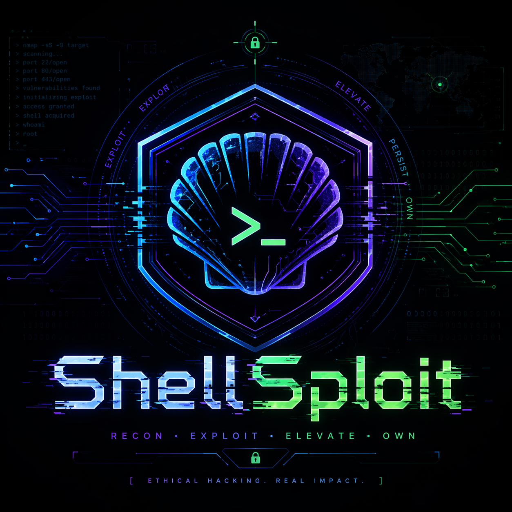
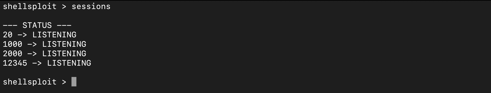

# 🛡️ Multi-Session Reverse Shell Manager 🚀



> ⚠️ **Disclaimer:** This project is for **educational purposes and ethical hacking labs only**. Unauthorized access to computer systems is illegal. Use this tool responsibly and only on systems you own or have explicit permission to test. 🚫

---

## 📖 Description

This is an advanced Python-based **Multi-Session Reverse Shell Manager**. Unlike basic listeners, this tool allows you to manage multiple incoming connections (sessions) simultaneously from a single command-line interface. You can interact with one device, put it in the background, and switch to another without losing the connection.

### ✨ Key Features
* 👥 **Multi-Session Management:** Control multiple targets at once.
* 🔄 **Session Persistence:** Listeners and active sessions are tracked in a `sessions.json` file.
* 📡 **Threaded Architecture:** Handles multiple connections concurrently using Python threading.
* 💻 **Cross-Platform:** Optimized for macOS and Linux environments.

---

## 🛠 Requirements

* 🐍 **Python 3.x**
* ☕ **Node.js** (For the companion web and websocket servers)
* 🌐 **Network Access:** Target and host must have connectivity in a lab environment.

---

## 📥 Installation

1.  **Automated Setup:**
    Give execution permissions to the install script and run it:
    ```bash
    chmod +x install.sh && ./install.sh
    ```

2.  **Manual Setup:**
    If the script fails, install dependencies manually:
    ```bash
    cd server && npm install && cd .. && pip3 install -r requirements.txt
    ```

---

## 🏗 Build Payloads

1.  **Enable Build Script:**
    ```bash
    chmod +x build.sh
    ```

2.  **Generate Your Payload:**
    Run the build script with your server details:
    ```bash
    ./build.sh <SERVER_URL> <WEBSOCKET_URL> <WEBSOCKET_AUDIO> <IP_ADDRESS> <PORT>
    ```

    **Example:**
    ```bash
    ./build.sh [http://192.168.8.9:2020](http://192.168.8.9:2020) ws://192.168.8.9:2020 ws://192.168.8.9:3030 192.168.8.9 2000
    ```
    📦 Your custom payload will be generated in the `dist/` folder.

---

## 🚀 Usage & Listeners

1. Start the Reverse Shell Listener
You can start multiple listeners by passing ports as arguments:
```bash
python3 reverse_shell.py 2000 3000 4000
```
2. Start the Servers
Navigate to the server folder and run the Node.js servers matching the ports in your payload:
```bash
cd server
npm run dev 2020 2021 3030
```
## ⌨️ Control Interface (shellsploit >)

| Command        | Action                                                                 |
|----------------|------------------------------------------------------------------------|
| sessions       | 📋 Lists all ports and status (LISTENING or ACTIVE).                   |
| use <port>     | 🔌 Switch focus to a specific active session to send commands.         |
| background     | 🔙 Detach from the current session and return to the main menu.        |
| clear          | 🧹 Clears the terminal screen.                                         |
| exit           | 🚪 Shuts down the manager and resets sessions.                         |

<p align="center">
<b>Developed for Ethical Learning 🎓</b>
<i>Check your local laws before testing!</i>
</p>

---

